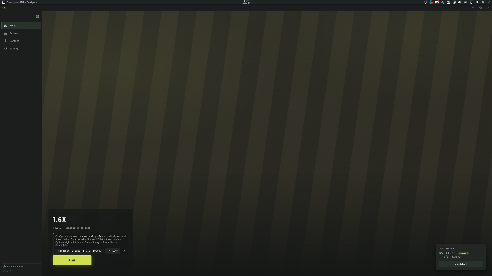
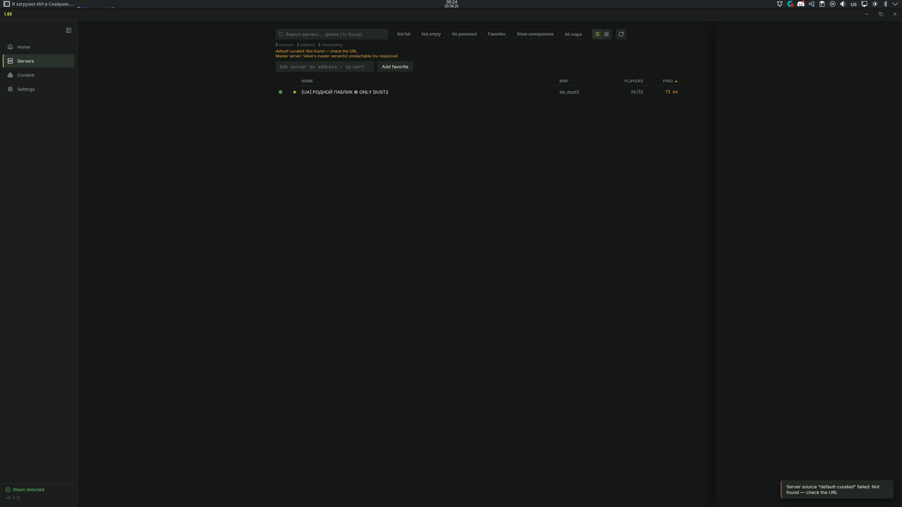
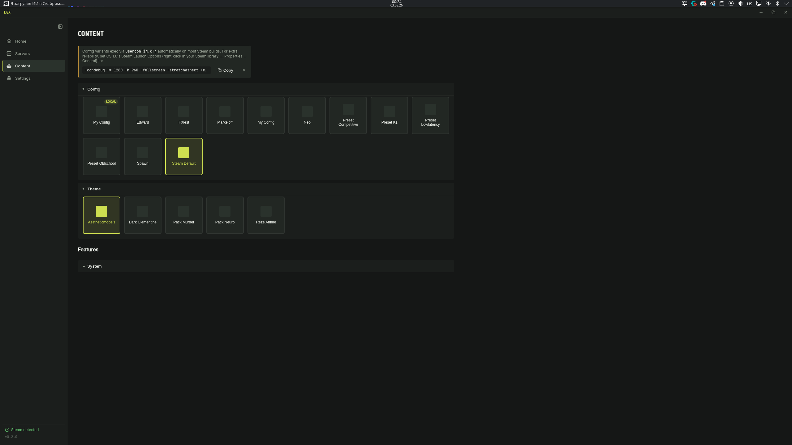
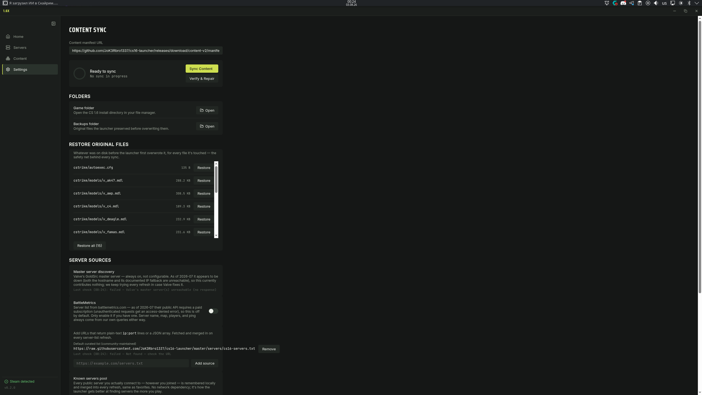
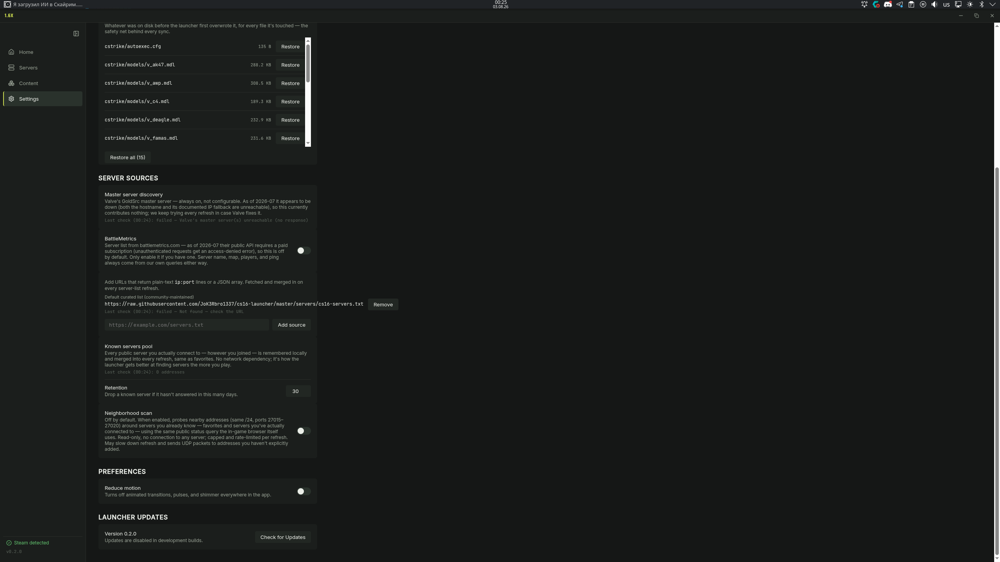

# 1.6X Launcher

**Status: active development** — usable day-to-day, but still evolving; the
screenshots below reflect the current version, not a final design.

A custom launcher for a **licensed Steam copy of Counter-Strike 1.6** — a game
wrapper around a curated content build, with a live server browser and
self-updates. Windows and Linux, built with Electron + React.

The launcher never bundles or redistributes any Steam game files. It detects
your existing CS 1.6 install and layers an optional, versioned content pack
(models/sounds/sprites/configs) on top of it, tracking exactly what it
changed so it can restore your original files at any time.

## Features

- **Steam detection** — finds your Steam install and CS 1.6 library across
  Windows/Linux automatically (registry on Windows, `libraryfolders.vdf`
  parsing everywhere), no manual path entry required.
- **Server browser** — live GoldSrc/Source A2S queries (map, players, ping),
  favorites, quick-connect, and a "last server" card on Home that re-checks
  its live status every time you return.
- **Variant content packs** — a manifest-driven content system with
  selectable slots (e.g. pick one HUD/model theme out of several) and
  optional feature toggles, synced by hash against a remote manifest.
  Every file the launcher touches is tracked and **backed up before being
  overwritten**, so `Verify & Repair` can always restore your original files
  — the real game install is never modified outside that tracked set.
- **Config presets** — variant/feature `.cfg` files are exec'd through a
  managed block the launcher maintains inside your own `cstrike/autoexec.cfg`;
  everything outside that block is left untouched.
- **Config security scanner** — every config file is statically scanned
  before it's ever applied. Critical findings (commands that could silently
  reconnect you to another server, leak/replay rcon credentials, or clear
  every keybind without restoring them) block installation outright;
  warnings (script aliases, chained binds) are shown but don't block. Each
  config gets a Safe Score and a details view with the exact file, line, and
  offending text — all 11 configs shipped in the built-in content pack score
  100/clean.
- **Crosshair customization** — two ways to get a custom crosshair, both off
  by default: a **native editor** that sets the game's own crosshair cvars
  (color, size, translucency, dynamic spread) — works everywhere, including
  exclusive fullscreen — and an **on-screen overlay** with more shapes,
  outline/opacity/offset controls, and multi-monitor support. The overlay is
  reliable on Windows and X11 Linux sessions; it's not currently reliable
  over Wayland compositors (window stacking and click-through can misbehave
  depending on your compositor), so the native editor is the better default
  choice there.
- **Self-updates** — the launcher updates itself via GitHub Releases
  (`electron-updater`), independently of content-pack versioning.
- **Background notifications** — opt-in polling of your favorite servers with
  rules for player-count thresholds, map matches, and quiet hours, so you can
  get notified when a favorite fills up without keeping the app in the
  foreground.
- **Desktop integration (Linux)** — an opt-in, one-click action that installs
  a proper `.desktop` entry for the AppImage, so notification clicks reliably
  raise and focus the launcher window under Wayland compositors.
- **Nickname tracking & friends online** — locally tracks player nicknames
  seen on servers you query or connect to, lets you mark any nickname as
  known with a note, and surfaces a "friends online" badge on the server
  browser and Home when a known player is currently on a server. Purely
  local — nothing is ever uploaded.
- **Profile export/import** — back up or move your whole setup (favorites,
  known servers, known players, notification rules, content selections, and
  your local config snapshot) as a single JSON file, with a merge-or-replace
  choice on import.
- **Headshot design system** — a from-scratch dark UI: an olive-accent token
  system, a live content-sync screen (per-file progress, ETA, verify/repair),
  a `Ctrl+K` command palette, and toasts — no legacy styling left over from
  earlier milestones.

## Screenshots

| Home | Servers |
| --- | --- |
|  |  |

| Content | Settings / Sync |
| --- | --- |
|  |  |

| Server Sources |
| --- |
|  |

## Install

Download the latest release for your platform from the
[Releases page](https://github.com/JoK3Rbro1337/cs16-launcher/releases/latest):

- **Windows** — download `16x-launcher-<version>.exe` and run the installer.
- **Linux** — download `16x-launcher-<version>.AppImage`, mark it executable,
  and run it:

  ```sh
  chmod +x 16x-launcher-*.AppImage
  ./16x-launcher-*.AppImage
  ```

The launcher checks for its own updates on startup; you generally only need
to do this once.

## Build from source

Requires Node.js 22+.

```sh
git clone https://github.com/JoK3Rbro1337/cs16-launcher.git
cd cs16-launcher
npm ci
npm run dev          # electron-vite dev server + Electron
```

Other useful scripts:

```sh
npm run typecheck    # tsc, main + preload + renderer projects
npm run build        # electron-vite build (no packaging)
npm run build:linux  # electron-vite build + electron-builder --linux (AppImage)
npm run build:win    # electron-vite build + electron-builder --win (NSIS installer)
```

Packaged builds are produced by `electron-builder` per `electron-builder.yml`
and are published automatically by CI (`.github/workflows/release.yml`) when
a `vX.Y.Z` tag is pushed.

## Authoring a content pack

Content packs are plain folders hashed into a manifest by
`scripts/generate-manifest.mjs`, then published as GitHub Release assets.

Folder convention (point `--content` at the directory containing these):

```
content/
  base/                    # always-synced, no selection needed
  slots/<slot>/<variant>/  # pick-one-of groups, e.g. slots/theme/aesthetic-models/
  features/<feature>/      # optional on/off toggles, e.g. features/hud-pack/
```

Every leaf folder is walked like a flat content tree — a file at
`slots/theme/aesthetic-models/cstrike/models/v_deagle.mdl` maps to the
in-game path `cstrike/models/v_deagle.mdl`. An optional `meta.json`
(`{"label": "Aesthetic Models"}`) in any slot/variant/feature folder sets its
display label; otherwise it's derived from the folder name. Any
`cstrike/*.cfg` file (other than `config.cfg`/`autoexec.cfg`) is
automatically treated as an exec'd config and wired into the managed
autoexec block when its variant/feature is active.

Generate and stage a manifest for release:

```sh
node scripts/generate-manifest.mjs \
  --content ./content \
  --version 1.4.2 \
  --repo <owner>/<repo> \
  --tag content-v2 \
  --stage ./release-assets
```

Then publish (content packs should **not** become the repo's default
release):

```sh
gh release create content-v2 ./release-assets/* manifest.json \
  --title "Content pack v1.4.2" --latest=false
```

Finally, point the launcher's Settings → Content manifest URL at the raw
`manifest.json` published for that tag.

## License

MIT
